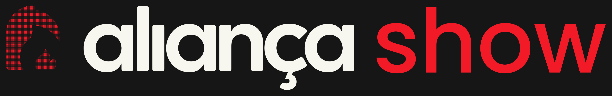

<p align="center">
  
</p>

<p align="center">
  Software de envio de vídeos e imagens para projetores e painéis de LED.
</p>

<p align="center">
  <a href="LICENSE"></a>
  &nbsp;
  
</p>

## Sobre

O AliançaShow é o programa de projeção usado nos cultos: ele monta o roteiro
antes e, na hora, controla o que aparece nas telas — letras de música, textos
bíblicos, vídeos, imagens e avisos — com saída para projetores e painéis de LED.

É um aplicativo de computador (Electron + Svelte), feito a partir do
[FreeShow](https://github.com/ChurchApps/FreeShow) 1.6.5, e herda tudo que o
FreeShow faz: apresentação de letras e slides, **stage display** para os músicos,
controle remoto pelo celular, importação de Bíblias, saída NDI, gravação,
transmissão e múltiplas saídas de vídeo simultâneas.

## O que muda em relação ao FreeShow

Este repositório é uma adaptação do FreeShow, não um projeto do zero. As
diferenças em relação ao original:

- **Identidade própria** — nome, ícones e logotipo do AliançaShow, com os
  arquivos de marca versionados em [`brand-aliancashow/`](brand-aliancashow).
  Os ícones originais do FreeShow ficaram guardados em
  `brand-aliancashow/_original-freeshow/` para referência.
- **Pasta de dados própria** — o app grava em `Documentos/AliancaShow`, então
  convive com uma instalação do FreeShow sem misturar os arquivos.
- **Assinatura de código desativada** — o build do Windows usava a conta Azure
  Code Signing do projeto original, à qual não temos acesso. O instalador sai
  sem assinatura e o SmartScreen avisa na primeira execução. O bloco está
  comentado em [`config/building/electron-builder.yaml`](config/building/electron-builder.yaml),
  pronto para receber uma conta própria.
- **CI só no manual** — os workflows de Release e WinGet não disparam sozinhos
  (veja [GitHub Actions](#github-actions)).

## Rodando em desenvolvimento

Requisitos:

- [Node.js](https://nodejs.org/) 22.12 ou superior
- [Python 3.12](https://www.python.org/downloads/) com o pacote
  [`setuptools`](https://pypi.org/project/setuptools/)
- **Windows:** [Visual Studio](https://visualstudio.microsoft.com/downloads/)
  com "Desenvolvimento para desktop com C++" e o Windows 10 SDK
- **Linux:** `sudo apt-get install libfontconfig1-dev`

Python e o compilador são necessários porque algumas dependências (NDI, áudio,
SQLite) são módulos nativos.

```bash
npm install   # instala e recompila os módulos nativos para o Electron
npm start     # abre o app em modo desenvolvimento, com recarga automática
```

## Gerando o instalador

```bash
npm run build   # compila frontend, servidores e o processo do Electron
npm run pack    # empacota sem instalador, em dist/ (bom para testar rápido)
npm run release # gera o instalador da plataforma atual
```

> `npm run release` está configurado para publicar o resultado no GitHub e
> precisa de um token com permissão de release. Para só gerar o arquivo local,
> use `npm run pack`.

**Atenção:** compilar não atualiza o AliançaShow que já está instalado na
máquina. Depois de gerar o instalador, é preciso instalar por cima para ver a
mudança no app do dia a dia.

## Onde ficam os dados

| O quê | Onde |
| --- | --- |
| Shows, projetos, temas e mídias | `Documentos/AliancaShow` |
| Configurações do app | pasta de dados do usuário do Electron (`AppData` no Windows) |

Os arquivos em `Documentos/AliancaShow` são o que interessa em um backup.

## Estrutura do repositório

```
src/electron/    processo principal do Electron (janelas, arquivos, NDI, streaming)
src/frontend/    interface em Svelte — é aqui que fica quase tudo
src/server/      servidores do controle remoto, do stage display e da câmera
src/common/      código compartilhado entre frontend e electron (Bíblias)
config/          build, lint, formatação, testes e tsconfig
scripts/         scripts de build, empacotamento e snap
public/          ícones e assets estáticos que vão para o app
brand-aliancashow/  arquivos de marca (logotipo, ícones, fontes)
```

## Qualidade

```bash
npm run lint            # eslint + stylelint, com correção automática
npm run format:prettier # formata src e scripts
npm test                # testes unitários, Playwright, formatação e svelte-check
```

## GitHub Actions

Os workflows em [`.github/workflows`](.github/workflows) rodam **apenas por
acionamento manual** (aba *Actions* → escolher o workflow → *Run workflow*):

| Workflow | O que faz |
| --- | --- |
| `build.yml` | compila o app nas três plataformas |
| `release.yml` | build + publicação de um release |
| `ci.yml` | verificação de formatação e tipos |
| `playwright.yml` | testes de interface |
| `winget.yml` | desativado — publicava o pacote do FreeShow no WinGet |

O `release.yml` disparava a cada push na `main` no projeto original; aqui foi
desligado de propósito, para não gerar releases sem querer.

## AliançaShow Remote

O [AliançaShow Remote](https://github.com/AliancaShow/AliancaShow-Remote)
(repositório privado) é o app web que a equipe abre no celular durante a semana
para enviar as fotos, vídeos e músicas do culto. Ele valida os arquivos contra
o que este programa consegue tocar — formato, tamanho e vídeo em HEVC — para
que nada falhe no domingo.

## Créditos e licença

O AliançaShow é um fork do **[FreeShow](https://freeshow.app/)**, criado e
mantido pela [ChurchApps](https://churchapps.org/) e por
[vassbo](https://github.com/vassbo). Todo o mérito do software original é deles
— aqui só houve adaptação de marca e de configuração.

Distribuído sob a licença **GPL-3.0**, a mesma do projeto original. Veja
[LICENSE](LICENSE). Se você distribuir o app modificado, precisa disponibilizar
o código-fonte junto, sob a mesma licença.
